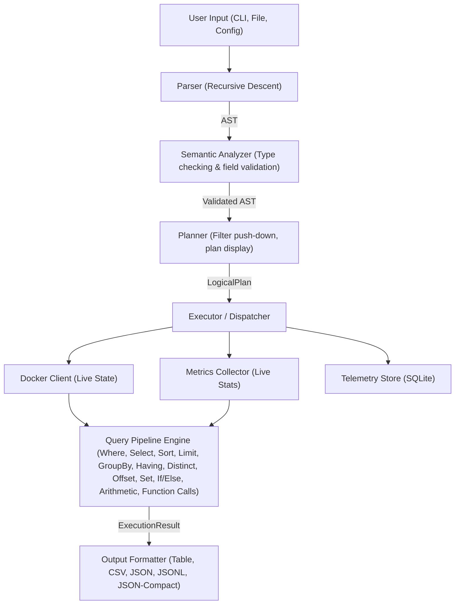

# DOL Architecture

This document outlines the high-level architecture of the Docker Observability Language (DOL) engine.

## Overview

DOL is designed as a pipeline that reads query strings, parses them into an Abstract Syntax Tree (AST), plans execution against underlying data sources (Docker API, metrics, SQLite store), and presents results to the user.

## Core Components

### 1. Parser (`src/parser.rs`)
A hand-written recursive descent parser that converts raw DOL strings into a strongly typed AST (`src/ast.rs`). It features detailed context-aware error reporting with source line display and a `^` pointer at the exact error column, plus explicit precedence handling for boolean operators (`and`, `or`, `not`), arithmetic operators (precedence climbing for `+`, `-`, `*`, `/`, `%`), and pipeline operators (`|`). Supports all expression types including arithmetic, function calls (`upper`, `lower`, `length`, `trim`, `concat`, `substring`, `coalesce`, `starts_with`, `ends_with`, `replace`, `reverse`, `repeat`, `position`, `split_part`, `now`, `date_format`, `date_diff`, `extract`), range checks (`between`, `is null`, `is not null`), string operators (`contains`, `matches`, `starts_with`, `ends_with`), aggregate functions (`sum`, `count`, `avg`, `min`, `max`), multi-field sort, inline comments (`#`), and all pipeline nodes (`where`, `select`, `group by`, `having`, `sort by`, `limit`, `offset`, `distinct`, `set`, `fill`, `let`, `if/then/else`, `alert`). Parser errors include the exact column position, a source context line with `-->` pointer, and a descriptive message. Each error can include an optional **suggestion** (e.g., "try one of: `observe`, `events`, `inspect`..." or "did you mean `containers`?"). In the CLI and REPL, errors are formatted in ANSI **red** with bold `error:` prefix, **cyan** `-->` source pointer, **green** `^` caret, and **yellow** `help:` suggestion via the `format_color()` method on `ParseError` and `EvalError`.

### 2. Semantic Analyzer (`src/semantic.rs`)
A static semantic analysis and type checking pass that runs immediately after parsing and before planning/execution. It validates:
- **Field Existence**: All referenced fields in filters, projections (`select`), and aggregations (`group by`) are checked against the static schema of the collection target. Dynamically added fields via `set`, `fill`, and `let` are tracked through the active schema context for downstream validation.
- **Label Prefix Support**: Dynamically resolved label lookups using the `label.` prefix (e.g., `label.env`) are recognized and statically validated as long as the base `labels` field exists on the target.
- **Type Compatibility**: Binary comparisons and arithmetic operations validate type compatibility (e.g., rejecting `state > 50` where `state` is a String). Boolean operators (`and`, `or`, `not`) require boolean operands. Unknown functions are rejected.
- **Pipeline Context**: The analyzer walks through pipeline nodes sequentially, maintaining the active schema as `select`, `group by`, `set`, `fill`, and `let` nodes modify it. Join-qualified field names (e.g., `c.name`, `i.repository`) are validated against the merged left/right schemas.
- **If/Else Branching**: Both `then` and `else` (including `else if`) branches are independently validated with the pre-branch schema context.

### 3. Planner (`src/planner.rs`)
Produces a `LogicalPlan` from the AST, performing filter push-down optimizations (e.g., moving `where` conditions closer to the data source). The plan is displayable for the `--explain` CLI flag, which shows the execution plan without running the query.

### 4. Executor (`src/executor.rs`)
The central coordinator that matches the AST against the requested query type (`observe`, `events`, `inspect`, `analyze`, `alert`, `logs`, `ping`, `fields`, `compose`). It dispatches to the correct engine module based on the verb, applies pipeline stages (where, select, group by, having, sort by, limit, offset, distinct, set, if/else, alert), and formats results. Supports five output formats: table, CSV, JSON, JSON-Compact (minified JSON), and JSONL.

Compose queries are dispatched to sub-targets (`services`, `networks`, `volumes`, `health`, `images`, `stats`, `ps`, `logs`, `port`, `config`, `events`). The `logs` and `networks` targets support real-time **streaming** mode when a pipeline is present — they subscribe to live Docker event/log streams filtered by compose project label and apply pipeline filters in real-time. (`events` is a batch operation — collects all events filtered by compose project, not a live stream.) ANSI-colored table output is auto-detected when the terminal supports it. The `render_diff` function compares current results against a stored snapshot. Parser errors are displayed in ANSI red with a source context line and `^` pointer at the error column.

### 5. Data Providers
- **Docker Client (`src/docker.rs`):** Interfaces with the Docker Engine daemon via the **bollard** crate (native Rust Docker API). The `DockerClient` trait provides fully async methods: `list_containers`, `list_images`, `list_networks`, `list_volumes`, `inspect_container`, `container_logs`, `container_stats`, `events_stream`, and `ping`. The `BollardDockerClient` implementation uses `connect_with_local_defaults()` or `connect_with_host()` for remote hosts. Container inspection enriches results with `started_at`, `finished_at`, `restart_count`, and health status. A `MockDockerClient` is available for unit testing.

  All bollard API calls have configurable **timeouts** via `DockerApiConfig` (stored in `BollardDockerClient.api_cfg`):
  - `call_timeout` (default 30s): general API calls (list, inspect, logs chunks)
  - `quick_timeout` (default 10s): lightweight calls (ping)
  - `max_retries` (default 2): retry count for unreliable operations (inspect, stats)
  - `retry_base_ms` (default 200ms): exponential backoff base (200ms, 400ms for retries 0 and 1)

  Three helper functions wrap all async calls with timeouts:
  - `docker_call(fut)` — wraps a future with `call_timeout`
  - `docker_call_quick(fut)` — wraps with `quick_timeout`
  - `docker_call_with_retry(|| fut)` — wraps with `call_timeout` plus exponential backoff retries (for `inspect_container` and `container_stats`)

  The `DockerError::Timeout(u64)` variant signals when a bollard operation exceeds its configured timeout.
- **Metrics Collector (`src/metrics.rs`):** Collects and normalizes live container metrics (CPU, Memory, Network I/O). Uses a ring buffer in memory to provide rolling averages if needed.
- **Telemetry Store (`src/storage.rs`, `src/sqlite_store.rs`):** Embedded SQLite database that persists metrics, events, and state snapshots for historical "time-travel" queries and retention.

### 6. Background Collector (`src/collector.rs`)
A standalone asynchronous task (`tokio`) that periodically polls the Docker API and writes metrics/snapshots to the Telemetry Store. Configurable intervals for both metrics collection and state snapshots via CLI flags (`--metrics-interval`, `--snapshot-interval`) or config file. Supports graceful shutdown via Ctrl+C.

### 7. Analysis Engine (`src/analyze.rs`)
A deterministic rules engine that scans telemetry data for anomalies (high CPU, memory pressure, restart loops, deployment errors, resource leaks) and computes container health signals. Also provides dependency analysis (compose/network/volume mapping), density analysis (distribution across images, states, projects), and config drift detection (comparing telemetry snapshots for image/state/label changes).

### 8. Expression Evaluator (`src/eval.rs`)
A recursive expression evaluation engine that resolves `Expression` AST nodes against row data. Supports field lookups (including label dot-access like `label.env`), literal values, arithmetic (`+`, `-`, `*`, `/`, `%`), comparison operators (`=`, `!=`, `>`, `<`, `>=`, `<=`, `contains`, `matches`), range checks (`between`, `is null`, `is not null`), boolean logic (`and`, `or`, `not`), `in` operator, and function calls:
- **String functions**: `upper`, `lower`, `length`, `trim`, `concat`, `substring`, `coalesce`, `starts_with`, `ends_with`, `replace`, `reverse`, `repeat`, `position`, `split_part`
- **Date/time functions**: `now`, `date_format`, `date_diff`, `extract`

The `eval_expr` function returns `JsonValue` (any type), while `eval_bool` wraps it with truthiness checking. The evaluator also provides `evaluate_set_value` for `SetValue` AST nodes (literal, expression, case/when, and if/else variants). Helper functions include `compare_json_values` for sorting and `render_json_cell` for display formatting.

### 9. Alerting Engine (`src/alerts.rs`)
Evaluates conditions against live metrics/state at intervals. Uses async `MetricsCollector` for data collection. Manages duration guards (e.g., `for 2m`) to prevent flapping, and triggers actions when conditions are met. Actions are executed in real time:
- **Webhook**: Sends an HTTP POST to the configured URL via `reqwest` (uses a dedicated tokio runtime in a background thread for async HTTP). Timeout is configurable via `webhook_timeout` (default 10s).
- **Restart**: Restarts the target container via bollard's `restart_container()` API (uses a dedicated tokio runtime in a background thread). Timeout is configurable via `restart_timeout` (default 30s).
- **Alert history**: Fired alerts are persisted to the telemetry store's `alert_history` table when `--store` is active.

### 10. Config Loader & Subcommand (`src/config.rs`)
Loads DOL settings from YAML or TOML files at standard paths (`~/.config/dol/config.yaml`, `.dolrc`, `dol.yaml`). Supports the following settings:

| Key | Default | Description |
|---|---|---|
| `store` | `~/.dol/store` | Path to telemetry store directory |
| `output` | `table` | Default output format (`table`, `csv`, `json`, `json-compact`, `jsonl`) |
| `host` | `unix:///var/run/docker.sock` | Docker daemon address |
| `metrics_interval` | `30` | Metrics collection interval (seconds) |
| `snapshot_interval` | `300` | State snapshot interval (seconds) |
| `theme` | `dark` | Table colour theme (`dark` or `light`) |
| `api_timeout` | `30` | Docker API call timeout (seconds) |
| `api_quick_timeout` | `10` | Lightweight API call timeout (seconds) |
| `stats_timeout` | `10` | Per-container stats timeout (seconds) |
| `events_timeout` | `30` | Events stream per-item timeout (seconds) |
| `webhook_timeout` | `10` | Alert webhook HTTP timeout (seconds) |
| `restart_timeout` | `30` | Alert container restart timeout (seconds) |

The `dol config init|set|view` subcommand provides CLI-based config management.

### 11. Interactive REPL (`src/repl.rs`)
A readline-based interactive shell (`dol repl`) with tab completion for DOL keywords, command history (persisted across sessions), and REPL-specific commands (`.watch`, `.export`, `.output`, `.history`, `.help`). Supports all query types: observe, events, inspect, alert, and fields.

### 12. Terminal Dashboard (`src/dashboard.rs`)
A ratatui-based TUI module providing two modes:
- **`dol top`**: Full-screen live-updating container table with auto-refresh (2s), color-coded states, sort controls, and keyboard navigation.
- **`dol dashboard`**: Multi-panel view with a container list and a live Docker events panel, focus-switchable via Tab.

Both modes use `crossterm` for raw terminal input and alternate screen rendering. Both modes (`dol top` and `dol dashboard`) spawn a background tokio task listening to Docker events via bollard's `events_stream()` API and use an event-driven refresh model — container state changes trigger an immediate full refresh (containers + metrics), metrics are polled every 2 seconds (asynchronously, without `block_on`), and a 30-second fallback timer ensures stale data is never shown if the events listener fails.

### 13. External Export Module (`src/export.rs`)
Provides push-based integration with three external monitoring systems:
- **InfluxDB**: Formats rows as InfluxDB line protocol and POSTs to the v1/v2 HTTP write API. String fields become tags, numeric fields become fields.
- **Grafana Loki**: Wraps rows as Loki JSON push payload with `app=dol,source=docker` labels and sends to `/loki/api/v1/push`.
- **Prometheus Pushgateway**: Converts numeric fields to gauge metrics in exposition format (`dol_<field>{container="...",image="...",state="..."} <value>`) and PUTs to the Pushgateway.

The `ExportFormat` enum (`Influx`, `Loki`, `Prometheus`) is also used with `--export-format` to write results to files in the respective formats.
`run_exports()` in `cli.rs` dispatches to the correct exporter based on CLI flags after each query execution, including in watch mode.

## Data Flow: Example Pipeline

When executing `observe containers where cpu > 80% | select name, cpu | sort cpu desc limit 5`:

1. **Parse**: The parser tokenizes and builds an AST representing the query.
2. **Plan**: The planner produces a LogicalPlan, applying filter push-down to evaluate `cpu > 80%` as early as possible.
3. **Fetch Data**: The Executor fetches all running containers via Docker Client and their current metrics via Metrics Collector.
4. **Merge**: Containers and metrics are zipped together into `Row` representations.
5. **Pipeline Filtering (`where`)**: The `where cpu > 80%` node evaluates the AST `Expression` against each row. Rows evaluating to `false` are dropped.
6. **Pipeline Projection (`select`)**: The `select name, cpu` node drops all columns except `name` and `cpu`.
7. **Pipeline Sorting (`sort`)**: The `sort cpu desc` node orders the rows in memory.
8. **Pipeline Limiting (`limit`)**: The `limit 5` node truncates the output to the top 5 rows.
9. **Render**: The resulting `ExecutionResult` is formatted using the selected output format (`--output` flag). The default table renderer uses ratatui widget rendering with box-drawing borders, colored headers, and per-cell color coding (green/yellow/red for CPU/memory thresholds, color-coded states). Falls back to a simpler ANSI-colored markdown-style table if the terminal is too narrow. Also supports CSV, JSON, JSON-Compact, and JSONL output.

The colour theme for table output can be controlled via `--theme dark|light` or the config file (`theme: dark|light`). The resolution order is: `--theme` flag > config file `theme` > `Theme::Dark` (default). The dark theme uses DarkGray alternating row backgrounds and cyan headings, while the light theme omits row backgrounds and uses blue headings for better contrast on light terminal backgrounds.

## CLI Integration

The CLI (`src/cli.rs`) uses `clap` for argument parsing. The main `Cli` struct defines all flags and subcommands shown in the table above. The `run()` function handles subcommand dispatch, flag processing (including `apply_host` to set `DOCKER_HOST`), query mode selection (store/alert/events/batch/watch), timeout management via `spawn_with_timeout`, and output/export pipeline.

Key flags include:

- `--theme <dark|light>` — colour theme for table output (`dark` with DarkGray alternating rows and cyan headings, or `light` with blue headings and no row tint); can be set permanently in config via `theme: dark|light`
- `--output <table|csv|json|json-compact|jsonl>` — output format selection (uses ratatui-based table rendering with ANSI colors)
- `--explain` — show logical plan without executing
- `--watch <s>` — repeat query every N seconds (batch and alert queries)
- `--timeout <s>` — query execution timeout via blocking thread with tokio timeout
- `--diff` — compare with last store snapshot
- `--export <path>` — write output to file
- `--export-format <influx|loki|prometheus>` — write export-format output to file
- `--file <path>` / `-f <path>` — read the DOL query from a `.dol` file
- `--host <addr>` — remote Docker daemon address (sets `DOCKER_HOST` env)
- `--completion <shell>` — generate shell completion script
- `--store-stats` — display telemetry store statistics
- `--apply-retention` — apply retention policies to clean old data
- `--collect` — start background data collection daemon
- `--export-influx <url>` — push results to InfluxDB
- `--export-grafana-loki <url>` — push results to Grafana Loki
- `--export-prometheus <url>` — push results to Prometheus Pushgateway
- `repl` — interactive REPL shell
- `top` — live-updating TUI container monitor
- `dashboard` — multi-panel TUI with containers and events
- `config init|set|view` — manage DOL configuration
