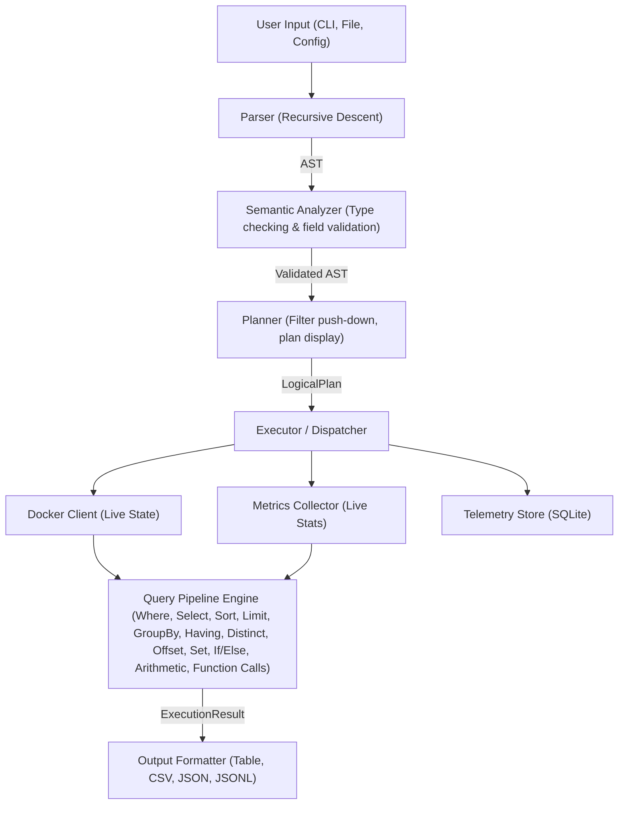

# DOL Architecture

This document outlines the high-level architecture of the Docker Observability Language (DOL) engine.

## Overview

DOL is designed as a pipeline that reads query strings, parses them into an Abstract Syntax Tree (AST), plans execution against underlying data sources (Docker API, metrics, SQLite store), and presents results to the user.

## Core Components

### 1. Parser (`src/parser.rs`)
A hand-written recursive descent parser that converts raw DOL strings into a strongly typed AST (`src/ast.rs`). It features detailed error reporting with line/column context and explicit precedence handling for boolean operators, arithmetic operators (precedence climbing), and pipeline operators. Supports arithmetic expressions (`+`, `-`, `*`, `/`, `%`), function calls (`upper`, `lower`, `length`, `trim`, `concat`, `substring`), range checks (`between`, `is null`, `is not null`), aggregate functions (`sum`, `count`, `avg`, `min`, `max`), multi-field sort, inline comments (`#`), and all pipeline nodes (`having`, `distinct`, `offset`).

### 2. Semantic Analyzer (`src/semantic.rs`)
A static semantic analysis and type checking pass that runs immediately after parsing. It validates that all referenced fields (including dynamic fields added via `set` and dotted label paths like `label.env`) are valid for the given target (Containers, Images, Networks, or Volumes). It also performs static type compatibility checking on binary comparisons and arithmetic expressions (e.g., rejecting comparisons of String fields to numeric literals before querying data sources).

### 3. Planner (`src/planner.rs`)
Produces a `LogicalPlan` from the AST, performing filter push-down optimizations (e.g., moving `where` conditions closer to the data source). The plan is displayable for the `--explain` CLI flag, which shows the execution plan without running the query.

### 4. Executor (`src/executor.rs`)
The central coordinator that matches the AST against the requested query type (`observe`, `events`, `inspect`, `analyze`, `alert`, `fields`). It dispatches to the correct engine module based on the verb, applies pipeline stages (where, select, group by, having, sort by, limit, offset, distinct, set, if/else, alert), and formats results. Supports four output formats: table, CSV, JSON, and JSONL. ANSI-colored table output is auto-detected when the terminal supports it. The `render_diff` function compares current results against a stored snapshot.

### 4. Data Providers
- **Docker Client (`src/docker.rs`):** Interfaces with the Docker Engine daemon (currently via Docker CLI wrapping) to list containers, images, volumes, networks, stream events, and inspect individual containers for enriched fields (`started_at`, `finished_at`, `restart_count`).
- **Metrics Collector (`src/metrics.rs`):** Collects and normalizes live container metrics (CPU, Memory, Network I/O). Uses a ring buffer in memory to provide rolling averages if needed.
- **Telemetry Store (`src/storage.rs`, `src/sqlite_store.rs`):** Embedded SQLite database that persists metrics, events, and state snapshots for historical "time-travel" queries and retention.

### 5. Background Collector (`src/collector.rs`)
A standalone asynchronous task (`tokio`) that periodically polls the Docker API and writes metrics/snapshots to the Telemetry Store.

### 6. Analysis Engine (`src/analyze.rs`)
A deterministic rules engine that scans telemetry data for anomalies (high CPU, memory pressure, restart loops, deployment errors) and computes container health signals.

### 7. Expression Evaluator (`src/eval.rs`)
A recursive expression evaluation engine that resolves `Expression` AST nodes against row data. Supports field lookups (including label dot-access like `label.env`), literal values, arithmetic (`+`, `-`, `*`, `/`, `%`), comparison operators (`=`, `!=`, `>`, `<`, `>=`, `<=`, `contains`, `matches`), range checks (`between`, `is null`, `is not null`), boolean logic (`and`, `or`, `not`), and function calls (`upper`, `lower`, `length`, `trim`, `concat`, `substring`, `coalesce`). The `eval_expr` function returns `JsonValue` (any type), while `eval_bool` wraps it with truthiness checking.

### 8. Alerting Engine (`src/alerts.rs`)
Evaluates conditions against live metrics/state at intervals. Manages duration guards (e.g., `for 2m`) to prevent flapping, and triggers actions when conditions are met. Actions are executed in real time:
- **Webhook**: Sends an HTTP POST to the configured URL via `reqwest`.
- **Restart**: Runs `docker restart <container>` via `std::process::Command`.
- **Alert history**: Fired alerts are persisted to the telemetry store's `alert_history` table when `--store` is active.

### 9. Config Loader & Subcommand (`src/config.rs`)
Loads DOL settings from YAML or TOML files at standard paths (`~/.config/dol/config.yaml`, `.dolrc`, `dol.yaml`). Supports `store`, `output`, `host`, `metrics_interval`, and `snapshot_interval` settings. The `dol config init|set|view` subcommand provides CLI-based config management.

### 10. Interactive REPL (`src/repl.rs`)
A readline-based interactive shell (`dol repl`) with tab completion for DOL keywords, command history (persisted across sessions), and REPL-specific commands (`.watch`, `.export`, `.output`, `.history`, `.help`). Supports all query types: observe, events, inspect, alert, and fields.

### 11. Terminal Dashboard (`src/dashboard.rs`)
A ratatui-based TUI module providing two modes:
- **`dol top`**: Full-screen live-updating container table with auto-refresh (2s), color-coded states, sort controls, and keyboard navigation.
- **`dol dashboard`**: Multi-panel view with a container list and a live Docker events panel, focus-switchable via Tab.

Both modes use `crossterm` for raw terminal input and alternate screen rendering. The dashboard spawns a background thread listening to `docker events --format "{{json .}}"` and uses an event-driven refresh model — container state changes trigger an immediate full refresh (containers + metrics), metrics are polled every 2 seconds, and a 30-second fallback timer ensures stale data is never shown if the events listener fails.

### 12. External Export Module (`src/export.rs`)
Provides push-based integration with three external monitoring systems:
- **InfluxDB**: Formats rows as InfluxDB line protocol and POSTs to the v1/v2 HTTP write API. String fields become tags, numeric fields become fields.
- **Grafana Loki**: Wraps rows as Loki JSON push payload with `app=dol,source=docker` labels and sends to `/loki/api/v1/push`.
- **Prometheus Pushgateway**: Converts numeric fields to gauge metrics in exposition format (`dol_<field>{container="...",image="...",state="..."} <value>`) and PUTs to the Pushgateway.

The `ExportFormat` enum (`Influx`, `Loki`, `Prometheus`) is also used with `--export-format` to write results to files in the respective formats.
`run_exports()` in `cli.rs` dispatches to the correct exporter based on CLI flags after each query execution, including in watch mode.

## Data Flow: Example Pipeline

When executing `observe containers where cpu > 80% | select name, cpu | sort cpu desc limit 5`:

1. **Parse**: The parser tokenizes and builds an AST representing the query.
2. **Plan**: The planner produces a LogicalPlan, applying filter push-down to evaluate `cpu > 80%` as early as possible.
3. **Fetch Data**: The Executor fetches all running containers via Docker Client and their current metrics via Metrics Collector.
4. **Merge**: Containers and metrics are zipped together into `Row` representations.
5. **Pipeline Filtering (`where`)**: The `where cpu > 80%` node evaluates the AST `Expression` against each row. Rows evaluating to `false` are dropped.
6. **Pipeline Projection (`select`)**: The `select name, cpu` node drops all columns except `name` and `cpu`.
7. **Pipeline Sorting (`sort`)**: The `sort cpu desc` node orders the rows in memory.
8. **Pipeline Limiting (`limit`)**: The `limit 5` node truncates the output to the top 5 rows.
9. **Render**: The resulting `ExecutionResult` is formatted as a Markdown-style table, CSV, JSON, or JSONL depending on the `--output` flag.

## CLI Integration

The CLI (`src/cli.rs`) uses `clap` for argument parsing. Key flags include:

- `--output <table|csv|json|jsonl>` — output format selection
- `--explain` — show logical plan without executing
- `--watch <s>` — repeat query every N seconds
- `--diff` — compare with last store snapshot
- `--export <path>` — write output to file
- `--host <addr>` — remote Docker daemon address
- `--completion <shell>` — generate shell completion script
- `repl` — interactive REPL shell
- `top` — live-updating TUI container monitor
- `dashboard` — multi-panel TUI with containers and events
- `config init|set|view` — manage DOL configuration
